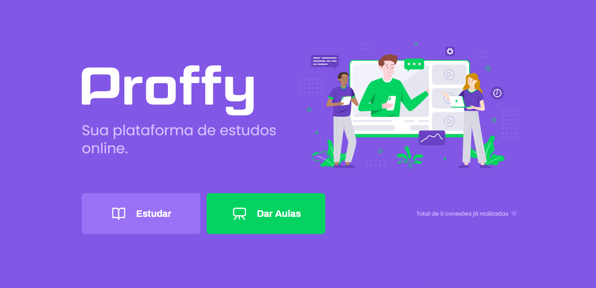
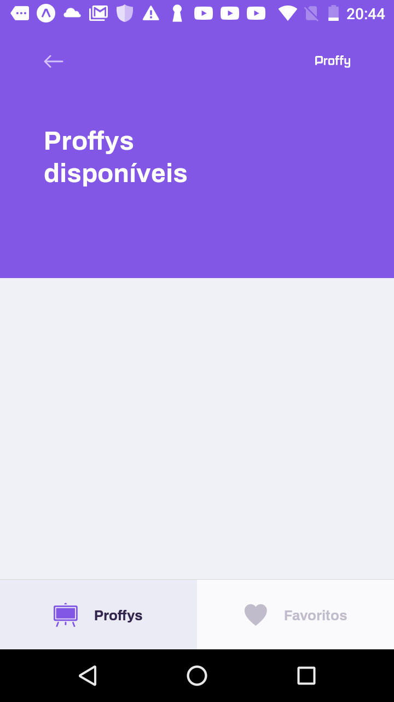
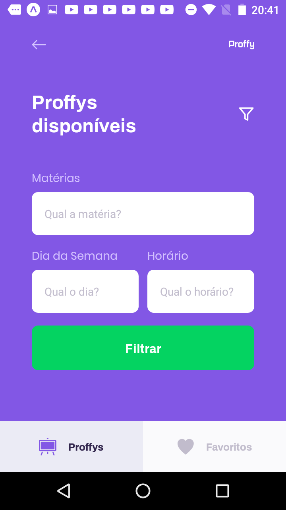
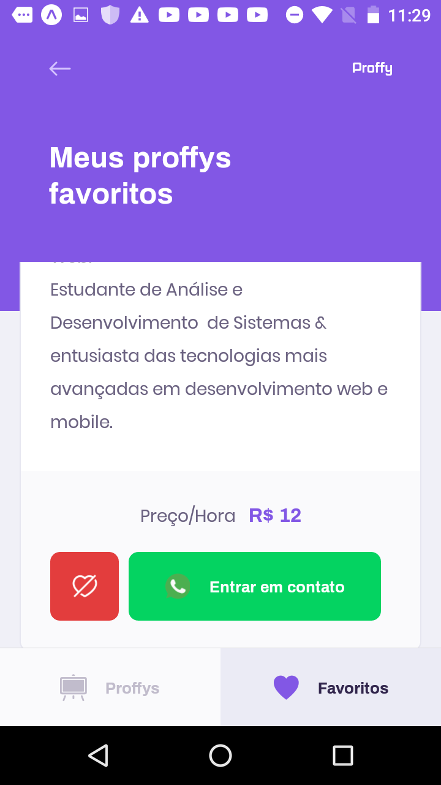
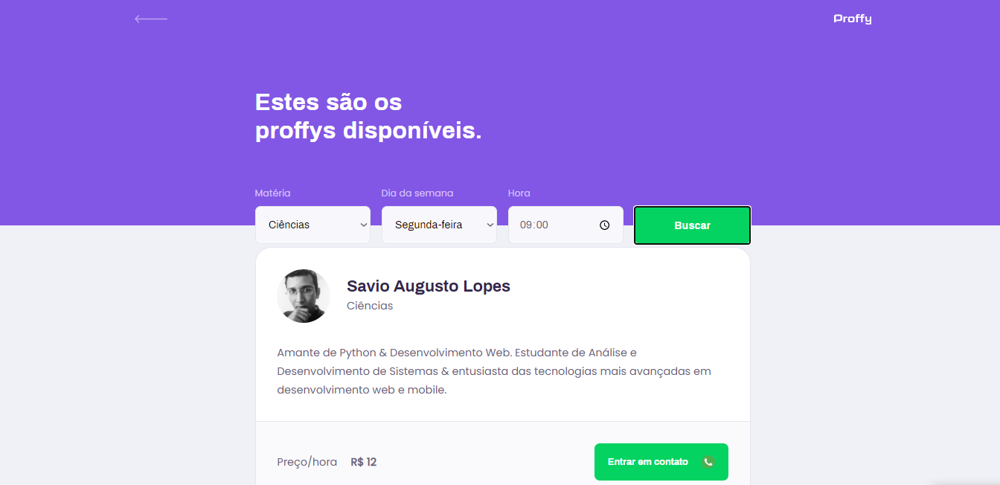
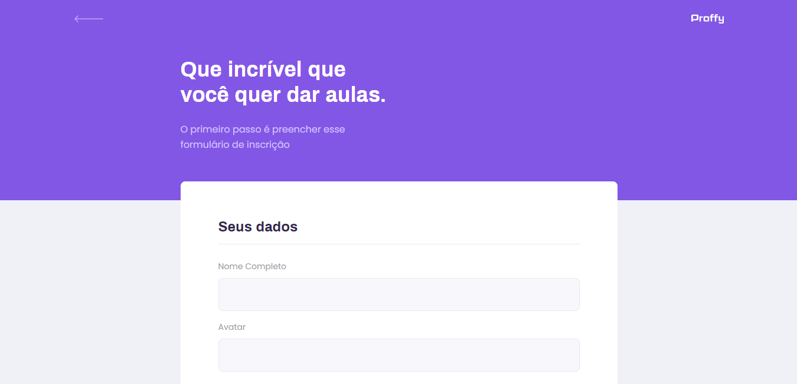
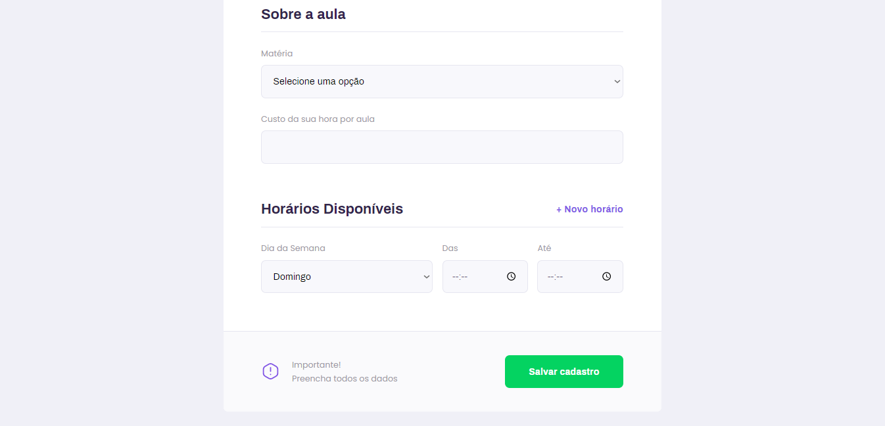

</p>
<h1 align="center">
    
</h1>

<h4 align="center"> 
	🚧  Proffy 1.0 :memo: Concluído 🚀 🚧
</h4>

<h4 align="center"> 
	🚧  Proffy - Trilha Extra :memo: Em andamento... 🚀 🚧
</h4>

<p align="center">
 <a href="#-sobre-o-projeto">Sobre</a> •
 <a href="#-funcionalidades">Funcionalidades</a> •
 <a href="#-layout">Layout</a> • 
 <a href="#-como-executar-o-projeto">Como executar</a> • 
 <a href="#-tecnologias">Tecnologias</a> • 
 <a href="#-autor">Autor</a> • >
</p>


## 💻 Sobre o projeto

:memo: Proffy - é uma forma de conectar professores particulares a estudantes interessados de maneira mais rápida e inutuitiva.

Projeto desenvolvido durante a **2º edição da NLW - Next Level Week** oferecida pela [Rocketseat](https://blog.rocketseat.com.br/primeira-next-level-week/).

---

## ⚙️ Funcionalidades

- [x] Os professores interessados podem se cadastrar na plataforma web enviando:
  - [x] Máterias
  - [x] Imagem/Avatar do professor(a)
  - [x] Nome do professor(a)
  - [x] Preço/Hora
  - [x] Dias e Horário de atuação de serviço
  - [x] Número para contato

- [x] Os estudantes tem acesso ao aplicativo móvel, onde podem:
  - [x] filtrar os professores cadastrados por máterias, dias da semanas e horários disponiveis.
  - [x] entrar em contato com a entidade através do WhatsApp

---

## 🎨 Layout

### Mobile

<p align="center">
  
  
  
  
  
  
</p>

### Web

<p align="center" style="display: flex; align-items: flex-start; justify-content: center;">
  
  
  
  
</p>

---

## 🚀 Como executar o projeto

Este projeto é divido em três partes:
1. Backend (pasta server) 
2. Frontend (pasta web)
3. Mobile (pasta mobile)

💡Tanto o Frontend quanto o Mobile precisam que o Backend esteja sendo executado para funcionar.

### Pré-requisitos

Antes de começar, você vai precisar ter instalado em sua máquina as seguintes ferramentas:
[Git](https://git-scm.com), [Node.js](https://nodejs.org/en/) e o gerenciador de pacotes [Yarn](https://yarnpkg.com).
Além disto é bom ter um editor para trabalhar com o código como [VSCode](https://code.visualstudio.com/)

#### 🎲 Rodando o Backend (servidor)

```bash

# Clone este repositório
$ git clone git@github.com/savio-2-lopes/Next-Level-Week-2.git

# Acesse a pasta do projeto no terminal/cmd
$ cd Next-Level-Week-2

# Vá para a pasta server
$ cd server

# Instale as dependências
$ yarn add

# Execute a aplicação em modo de desenvolvimento
$ yarn run dev:server

# O servidor inciará na porta:3333 - acesse http://localhost:3333 

```

#### 🧭 Rodando a aplicação web (Frontend)

```bash

# Clone este repositório
$ git clone git@github.com/savio-2-lopes/Next-Level-Week-2.git

# Acesse a pasta do projeto no terminal/cmd
$ cd Next-Level-Week-2

# Vá para a pasta da aplicação Front End
$ cd web

# Instale as dependências
$ yarn add

# Execute a aplicação em modo de desenvolvimento
$ yarn start

# A aplicação será aberta na porta:3000 - acesse http://localhost:3000

```

## 🛠 Tecnologias

As seguintes ferramentas foram usadas na construção do projeto:

#### **Website**  ([React](https://reactjs.org/)  +  [TypeScript](https://www.typescriptlang.org/))

-   **[React Router Dom](https://github.com/ReactTraining/react-router/tree/master/packages/react-router-dom)**
-   **[React Icons](https://react-icons.github.io/react-icons/)**
-   **[React-scripts](https://github.com/facebook/create-react-app/tree/master/packages/react-scripts)**
-   **[React-dom](https://github.com/facebook/react/tree/master/packages/react-dom)**
-   **[Typescript](https://github.com/microsoft/TypeScript)**

#### **Server**  ([NodeJS](https://nodejs.org/en/)  +  [TypeScript](https://www.typescriptlang.org/))

-   **[Express](https://expressjs.com/)**
-   **[CORS](https://expressjs.com/en/resources/middleware/cors.html)**
-   **[KnexJS](http://knexjs.org/)**
-   **[SQLite](https://github.com/mapbox/node-sqlite3)**
-   **[ts-node](https://github.com/TypeStrong/ts-node)**
-   **[Typescript](https://github.com/microsoft/TypeScript)**

#### **Mobile**  ([React Native](http://www.reactnative.com/)  +  [TypeScript](https://www.typescriptlang.org/))

-   **[Expo](https://expo.io/)**
-   **[Expo Google Fonts](https://github.com/expo/google-fonts)**
-   **[Axios](https://github.com/axios/axios)**
-   **[React-dom](https://github.com/facebook/react/tree/master/packages/react-dom)**
-   **[React-native](https://github.com/facebook/react-native)**

---


## 🦸 Autor

<a href="https://github.com/savio-2-lopes">
 
 <br>
 <sub><b>    Savio Lopes </b></sub></a> <a href="https://github.com/savio-2-lopes" title="Github">  🚀</a>
 <br><br>
 
 
[](https://www.linkedin.com/in/savio-lopes/) 
[](https://github.com/savio-2-lopes)
[](https://api.whatsapp.com/send?phone=12996798894&text=Hello!)
[](mailto:savioaugulopes@gmail.com)


Feito com ❤️ por Savio Lopes 👋🏽 [Entre em contato!](https://www.linkedin.com/in/savio-lopes/)
